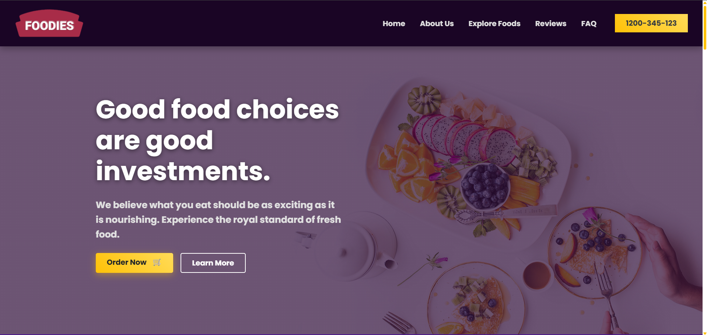
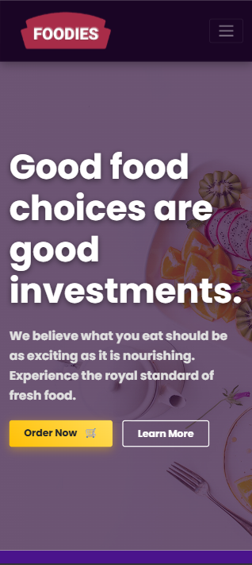

# 🥗 Foodies - Premium Restaurant Landing Page

A modern, responsive, and animated landing page designed for a high-end food chain. Built with **HTML5**, **CSS3**, **Bootstrap 4**, and **Vanilla JavaScript**.

## 📸 Project Preview

| **Desktop View** | **Mobile View** |
|:---:|:---:|
|  |  |
*(Note: The site is fully responsive across all device sizes.)*

Go on.. Try it!
https://yedumsy.github.io/foodie/

## 🚀 Features

* **Responsive Design:** Fully adapts to Mobile, Tablet, and Desktop screens using the Bootstrap 4 Grid System.
* **Scroll Animations:** Elements fade, zoom, and slide in using the **AOS (Animate On Scroll)** library.
* **Dynamic Counters:** Custom Vanilla JS implementation (using `IntersectionObserver`) for "counting up" statistics when they enter the viewport.
* **Parallax Scrolling:** Immersive background effects with moody "Dark Mode" overlays.
* **Interactive UI:** Hover effects on cards (shine & zoom), custom checked lists, and smooth scrolling navigation.
* **Theme Customization:** Advanced CSS overrides to transform Bootstrap's default styling.

## 🎨 Design & Theming (The "Danger" Class Override)

If you inspect the HTML source code, you will notice frequent use of Bootstrap's standard `text-danger` (red) and `bg-danger` classes.

**Why is it Purple & Gold?**
Initially, this project was prototyped using Bootstrap's standard "Danger" (Red) color scheme to fit a fast-food aesthetic. However, during development, the design direction pivoted to a premium, **"Royal & Savory"** aesthetic.

Instead of refactoring the entire HTML structure, I utilized the power of **CSS Specificity** to override the default Bootstrap colors globally:

* `.text-danger` was remapped to **Royal Purple** (`#6f42c1`).
* `.bg-danger` was remapped to **Deep Purple** (`#4a148c`).
* `.btn-danger` was remapped to a **Metallic Gold Gradient** with a custom glow effect.

This approach demonstrates how a Bootstrap theme can be visually overhauled via CSS without modifying the underlying component markup.

## 🛠️ Technologies Used

* **Frontend:** HTML5, CSS3, JavaScript (ES6)
* **Framework:** [Bootstrap 4.6](https://getbootstrap.com/docs/4.6/getting-started/introduction/)
* **Libraries:**
    * [AOS](https://michalsnik.github.io/aos/) (Animate On Scroll)
    * [Google Fonts](https://fonts.google.com/) (Poppins)
* **Icons:** SVG Icons (Custom colored using CSS Filters)

## 📂 Folder Structure

```text
/
├── src/
│   └── images/       # Backgrounds, food items, and social icons
├── screenshots/      # Preview images for README
├── food.css          # Custom styles and Bootstrap overrides
├── food.js           # Logic for AOS and Counter Animations
├── food.html         # Main structure
└── README.md         # Project documentation
